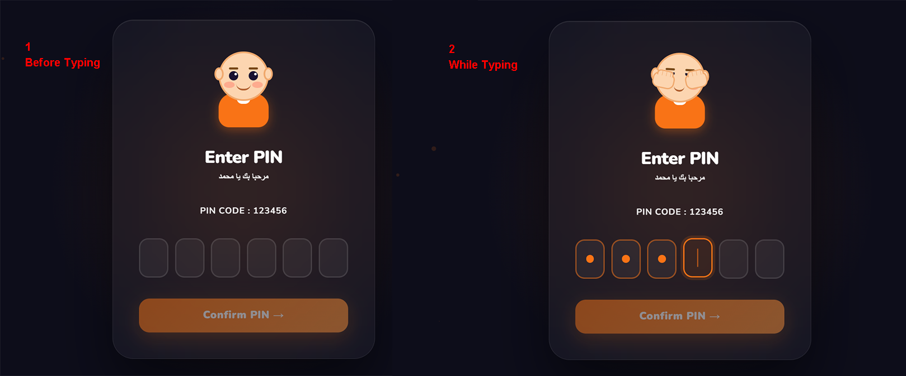
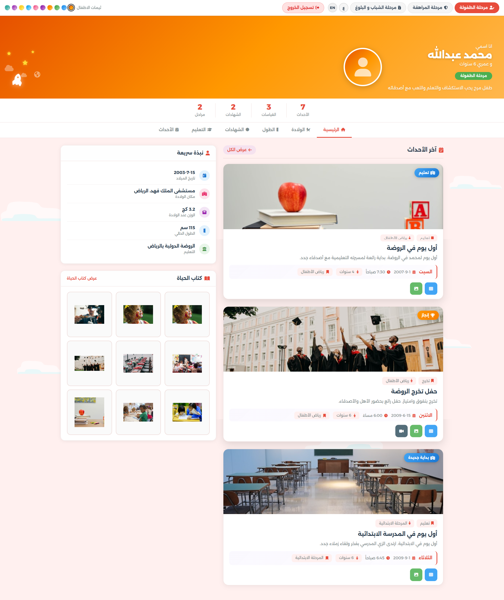
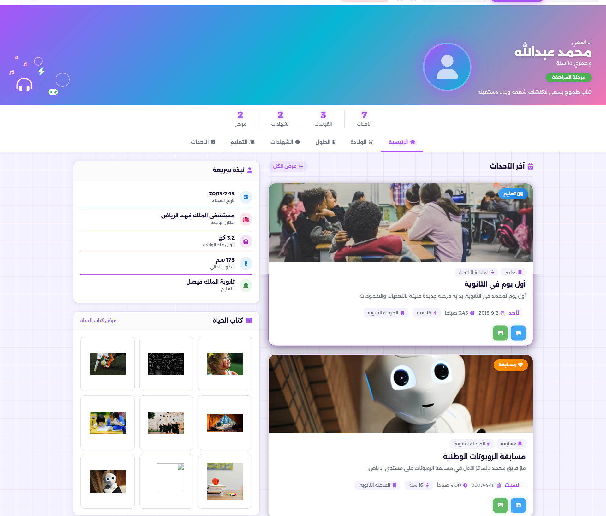
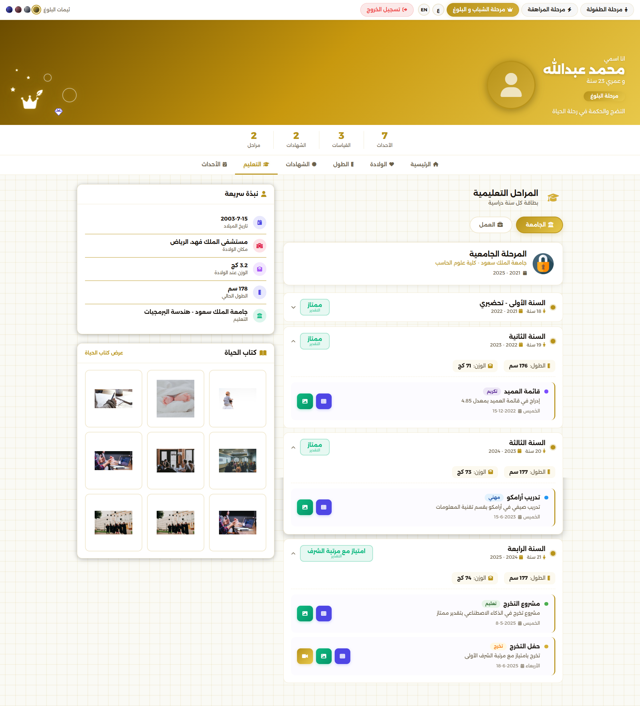
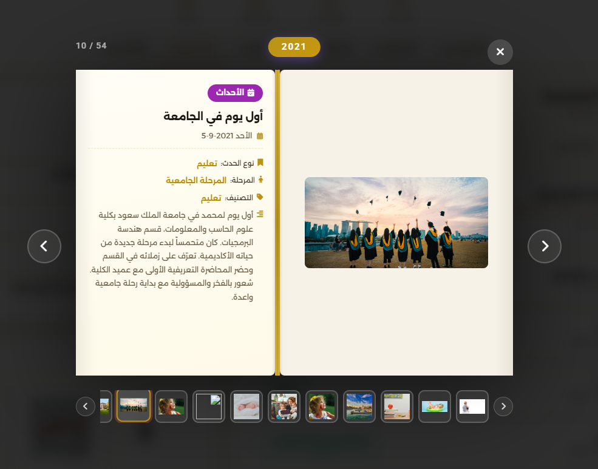

# Sirah — سيرة | Life Stages Portfolio

A beautifully designed, bilingual (Arabic/English) web application that documents a person's life journey across three distinct stages: **Childhood**, **Teenage**, and **Adulthood**. Each stage features its own themed page with dynamic content, interactive elements, custom loaders, and scroll animations — all driven by structured JavaScript data.

## Screenshots

### PIN Login

> Animated character reacts to user input — covers eyes while typing, celebrates on success, frowns on failure.

### Kids Stage (مرحلة الطفولة)

> Playful, colorful theme with cartoon icons, floating bubbles, and an owl loading animation.

### Teen Stage (مرحلة المراهقة)

> Bold neon-accented theme with geometric shapes, dark mode aesthetic, and a pencil-drawing loader.

### Adults Stage (مرحلة البلوغ)

> Elegant gold-and-dark theme with cursor-light effect, premium feel, and 3D-box loading animation.



A central interactive Life Book that gathers and preserves all life events across stages.

---

## Features

- **Three Life Stages** — Childhood (0-12), Teen (13-18), Adulthood (19-23), each with a unique visual identity
- **PIN Login Page** — Animated character with eye-tracking, hand gestures, and emotional feedback
- **Dynamic Data Rendering** — All content (events, measurements, certificates, education) is generated from structured JS data files
- **Bilingual Support** — Full Arabic (RTL) and English (LTR) language toggle with live switching
- **10 Theme Palettes Per Page** — Instant theme switching via color dots in the navbar
- **Tab-Based Navigation** — Home, Birth, Height, Certificates, Education, and Events tabs
- **Interactive Photo Gallery** — Lightbox modal with keyboard navigation and book-style carousel
- **Scroll Animations** — Intersection Observer-based reveal effects on scroll
- **Custom Page Loaders** — Unique CSS animations per page (owl, pencil SVG, 3D gold boxes)
- **Responsive Design** — Mobile-first layout using Bootstrap RTL grid
- **Modular Architecture** — Shared renderers/utilities with page-specific data and logic

---

## Tech Stack

<div align="center">


</div>


<p align="center">
HTML5 • CSS3 • Bootstrap 5.3 RTL • JS ES6+ • Font Awesome • Google Fonts • Figma
</p>

---

## How to Run

### Quick Start

1. **Clone the repository**
   ```bash
   git clone https://github.com/hayati.git
   cd hayati
   ```

2. **Open in browser**
   - Double-click `pin-login.html` to start from the login page
   - Or open any page directly: `index.html` (kids), `teen.html`, `adults.html`

3. **PIN Code**
   - Enter `123456` on the login page to proceed

### Using a Local Server (optional, for best experience)

```bash
# Python
python -m http.server 8080

# Node.js (if you have npx)
npx serve .

# VS Code
# Install "Live Server" extension → right-click pin-login.html → "Open with Live Server"
```

Then visit `http://localhost:8080/pin-login.html`

---

## Data Customization

Each page's content is fully driven by its `data.js` file. To customize for a different person:

1. Edit `js/kids/data.js`, `js/teen/data.js`, or `js/adults/data.js`
2. Update the `APP_DATA` object — profile info, birth details, events, measurements, certificates, and education stages
3. Replace image URLs with your own photos
4. The renderers will automatically generate the updated HTML

---

